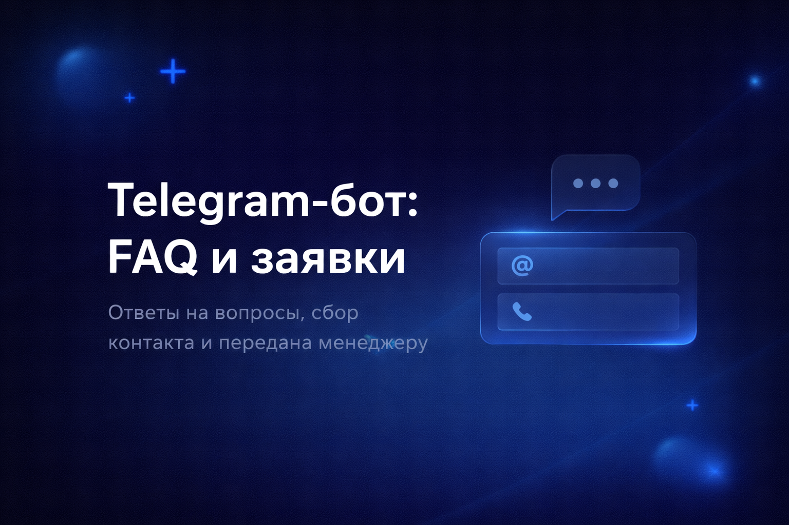
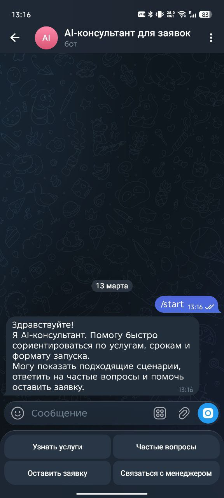
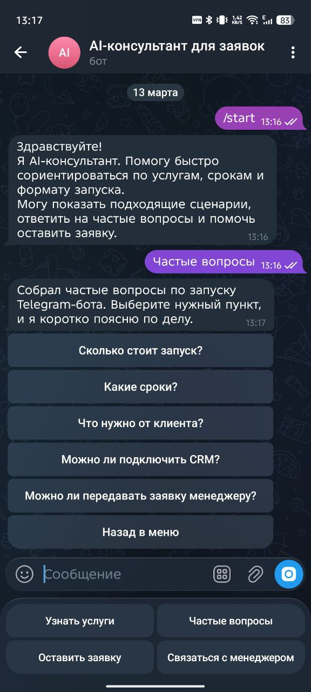
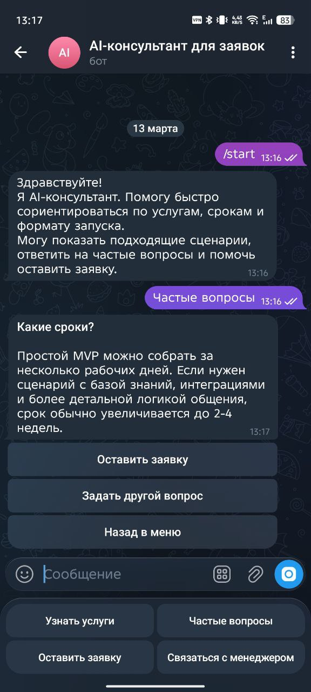
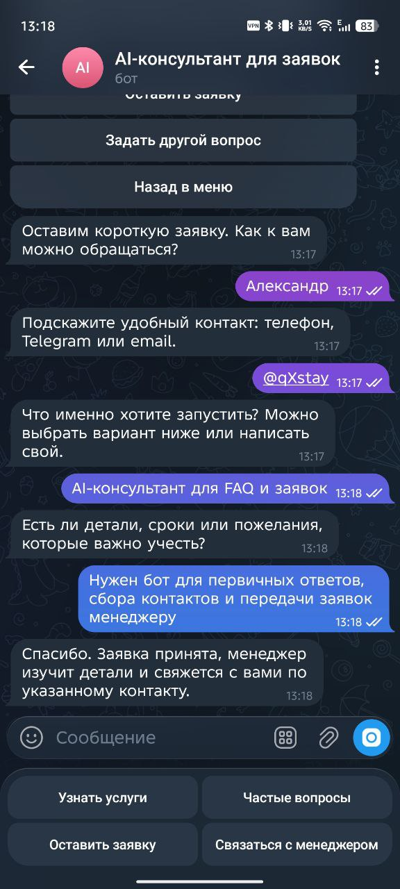
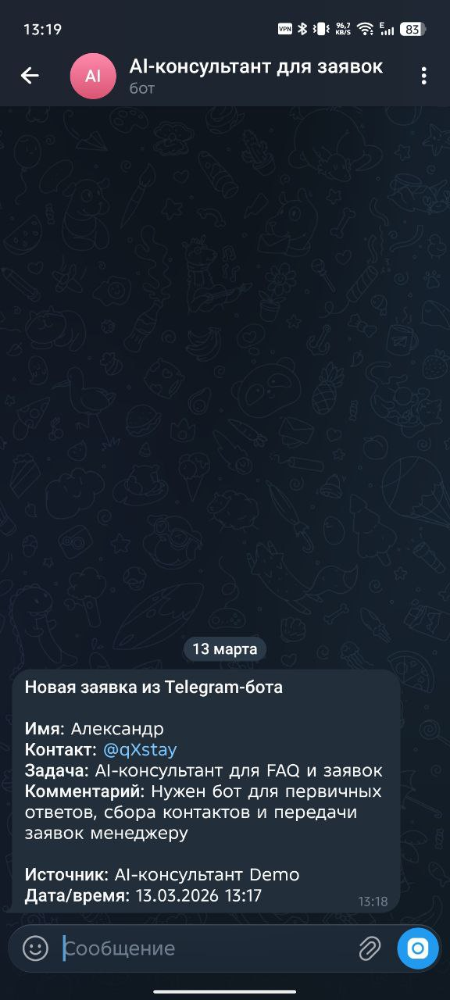

# Telegram AI Consultant Bot

Рабочий Telegram-бот прототип для портфолио. Показывает реальный сценарий: FAQ, сбор заявки и передача лида менеджеру внутри одного аккуратного диалога.



## О проекте

Это showcase prototype на основе реальных бизнес-сценариев. Бот помогает быстро сориентировать клиента по услугам, отвечает на частые вопросы, собирает контакт и передает заявку менеджеру.

## Бизнес-сценарий

MVP AI-консультанта для Telegram, который помогает:

- быстро сориентировать клиента по услугам
- снять типовые вопросы до разговора с человеком
- собрать контакт и задачу в удобном формате
- передать заявку менеджеру без лишней инфраструктуры

## Стек

- Python
- aiogram 3
- python-dotenv
- sqlite3
- JSON FAQ data

## Локальный запуск

```bash
pip install -r requirements.txt
```

Настройте `.env`:

```env
BOT_TOKEN=your_bot_token_here
MANAGER_CHAT_ID=123456789
```

Запуск:

```bash
python bot.py
```

## Скриншоты

### Главное меню



### FAQ и ответ



### Форма заявки



### Подтверждение для пользователя



### Уведомление менеджеру



## Примечание

Это рабочий showcase prototype для GitHub и клиентского портфолио, собранный на основе реальных бизнес-сценариев Telegram-ботов: консультация, квалификация лида и передача заявки менеджеру.
